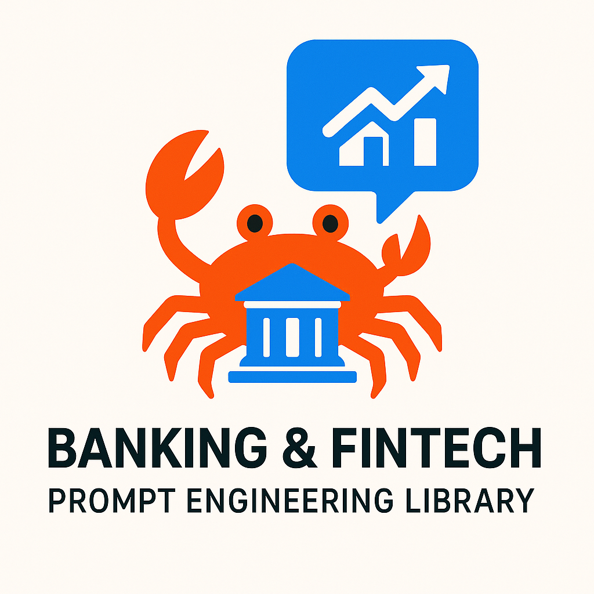

<div align="center">
  
</div>

# Banking & Fintech Prompt Engineering Library 🦀🏦

A simplified, educational Rust library for learning prompt engineering concepts and Rust programming patterns, specialized for banking and financial services applications.

## 🎯 Learning Objectives

This library is designed to teach:
- **Builder Pattern**: Fluent API design for constructing complex objects
- **Trait-based Abstraction**: Creating interfaces for different implementations
- **Async Programming**: Non-blocking operations with async/await
- **Structured Code**: Clean, readable, and well-documented Rust code
- **Prompt Engineering**: Organizing and structuring prompts for LLMs

## 🚀 Quick Start

### Run the Demo
```bash
cargo run
```

### Run Tests
```bash
cargo test
```

## 📚 Core Concepts

### 1. Prompt Structure
Prompts are organized into logical sections:
- **Goal**: What you want to achieve
- **Context**: Background information
- **Role**: The persona for the LLM to adopt
- **Steps**: Specific instructions or actions
- **Examples**: Input/output demonstrations
- **Output**: Desired response format

### 2. Builder Pattern
```rust
let prompt = PromptBuilder::new()
    .goal("Analyze customer feedback")
    .role("Data analyst")
    .step("Load the data")
    .step("Perform analysis")
    .output("Summary report")
    .build();
```

### 3. Template System
Pre-built templates for banking and fintech use cases:
```rust
let template = PromptTemplate::CreditRiskAssessment {
    credit_type: "personal loans".to_string(),
    risk_focus: "default probability assessment".to_string(),
};
let prompt = template.to_builder().build();
```

### 4. Available Banking & Fintech Templates

- **CreditRiskAssessment**: For loan evaluation and credit risk analysis
- **FraudDetection**: For transaction monitoring and fraud prevention
- **RegulatoryCompliance**: For compliance assessment and audit preparation
- **MarketAnalysis**: For financial market analysis and investment insights
- **FinancialAdvisory**: For wealth management and investment recommendations

### 5. LLM Client Abstraction
```rust
#[async_trait]
pub trait SimpleLLMClient: Send + Sync {
    async fn generate(&self, prompt: &str) -> Result<String>;
}
```

## 🏗️ Architecture

The library consists of:

1. **Core Data Structures** (`PromptSection`, `Prompt`)
2. **Builder Pattern** (`PromptBuilder`)
3. **Template System** (`PromptTemplate` with 5 common patterns)
4. **LLM Interface** (`SimpleLLMClient` trait)
5. **Mock Implementation** (`MockLLMClient`)
6. **Demo & Tests**

## 🔍 Code Walkthrough

### Main Components

```rust
// Define what goes in a prompt
pub enum PromptSection {
    Goal(String),
    Context(String),
    Role(String),
    Step(String),
    Example { user: String, assistant: String },
    Output(String),
}

// Build prompts fluently
pub struct PromptBuilder {
    prompt: Prompt,
}

// Abstract LLM communication
#[async_trait]
pub trait SimpleLLMClient: Send + Sync {
    async fn generate(&self, prompt: &str) -> Result<String>;
}
```

### Usage Examples

#### Manual Prompt Building
```rust
// Build a structured credit risk assessment prompt manually
let prompt = PromptBuilder::new()
    .goal("Assess credit risk for mortgage application")
    .context("30-year fixed rate mortgage, $400k loan amount")
    .role("Senior Credit Risk Analyst")
    .step("Analyze credit history and FICO score")
    .step("Evaluate debt-to-income ratio")
    .step("Assess employment stability")
    .example(
        "FICO 720, DTI 35%, 3 years employment",
        "Moderate risk - approve with standard terms"
    )
    .output("Risk assessment with approval recommendation")
    .build();
```

#### Template-Based Building
```rust
// Use a pre-built template for fraud detection
let template = PromptTemplate::FraudDetection {
    channel: "online banking".to_string(),
    scope: "real-time monitoring".to_string(),
};
let prompt = template.to_builder().build();

// Or customize a template for regulatory compliance
let compliance_template = PromptTemplate::RegulatoryCompliance {
    regulation: "AML/KYC".to_string(),
    focus: "customer due diligence".to_string(),
};
let custom_prompt = compliance_template.to_builder()
    .step("Review beneficial ownership documentation")
    .build();

// Send to LLM
let llm_client = MockLLMClient;
let response = llm_client.generate(&prompt.to_string()).await?;
```

## 🧪 Testing

The library includes comprehensive tests demonstrating:
- Builder pattern functionality
- Mock LLM client behavior
- Example section formatting
- Error handling

## 🎓 Educational Value

This simplified version focuses on:

✅ **Readability**: Every line is documented and explained  
✅ **Simplicity**: Core concepts without overwhelming complexity  
✅ **Best Practices**: Rust patterns and async programming  
✅ **Practical Examples**: Real-world prompt engineering scenarios  
✅ **Progressive Learning**: Build understanding step by step  

## 🛠️ Dependencies

Minimal dependencies for educational clarity:
- `anyhow`: Error handling
- `async-trait`: Async trait support
- `serde`: Serialization (for structured data)
- `tokio`: Async runtime

## 🚀 Next Steps

After understanding this simple version, you can:
1. Add real LLM client implementations (OpenAI, Anthropic)
2. Implement caching for efficiency
3. Add batch processing capabilities
4. Create a web interface
5. Add more sophisticated prompt templates

## 📝 License

MIT OR Apache-2.0

---

**Happy Learning! 🦀✨** 
